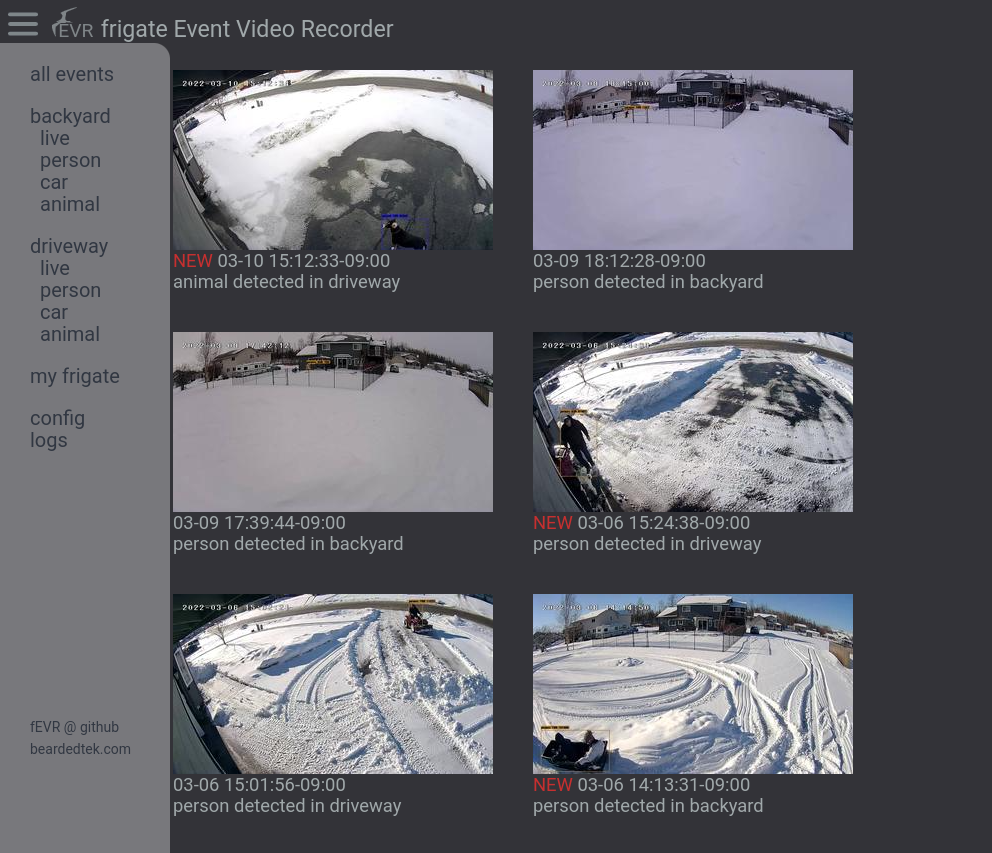

# fEVR - frigate Event Video Recorder

fEVR works along side of [frigate](https://frigate.video) and [home assistant](https://www.home-assistant.io/) to collect video and snapshots of objects detected using your existing camera systems.

## Features
- Stores video independently of frigate
- Home Assistant generates notifications and makes a RESTful command to fEVR to grab data from frigate
- fEVR stores, sorts, and makes browsing frigate events a snap.



### Cloud Instances of fEVR
- I will be offering cloud instances of fEVR starting on March 31st.
- [Click here](https://github.com/sponsors/BeardedTek-com) for more details.
### Cloud BETA Testing
- If you would like to beta test this feature, please let me know by submitting an issue.

## Known Bugs
-  [HTMLDialogElement.showModal() does not work properly in Firefox < 98](https://developer.mozilla.org/en-US/docs/Web/API/HTMLDialogElement/showModal#browser_compatibility)
- [See Issues for other known bugs.](https://github.com/BeardedTek-com/fEVR/issues)

## Requirements:
- [home assistant](https://home-assistant.io)
- [frigate](https://frigate.video)

## Install
The easiest and recommended method of install is docker-compose.
- Included is a container running tailscale to securely access fEVR.  This is not 100% necessary, but far more secure.
- Edit [docker-compose.yml](./docker-compose.yml) and bring the stack up:
```
sudo docker-compose up -d
```
- After stack is up, issue the following command to bring up tailscale:
```
sudo docker-compose exec tailscale tailscale up --advertise-routes=192.168.100.0/24 --accept-routes
```
- Follow the Auth URL and either add to your existing account or create a new one.  Its free and easy to use.

```yml
version: '3'
services:
  tailscale:                                      # Provides tailscale functionality for the stack
    #build:                                       # By default it uses the 192.168.100.0/24 network
    #  context: ./docker/tailscale                # Start tailscale once the container is up:
    #  dockerfile: Dockerfile                     # docker-compose exec tailscale tailscale up --advertise-routes=192.168.100.0/24 --accept-routes
    image: ghcr.io/beardedtek-com/tailscale:v0.4  # This will provide you with the Authorization URL to sign into tailscale.
    container_name: tailscale                     # If you don't have an account, its simple and free to signup.
    restart: unless-stopped 
    volumes:
      - ./vol/tailscale/data:/data
      - ./vol/tailscale/var_lib:/var/lib          # Required for tailscale
      - /dev/net/tun:/dev/net/tun                 # Required for tailscale
    cap_add:
      - net_admin                                 # Required for tailscale
      - sys_module                                # Required for tailscale
    networks:
      beardnet:
        ipv4_address: 192.168.100.253
    privileged: true
  fevr:
    #build:
    #  context: ./docker/fEVR
    #  dockerfile: Dockerfile
    image: ghcr.io/beardedtek-com/fevr:v0.4
    container_name: fevr
    restart: unless-stopped
    privileged: true
    depends_on:                                   # Comment this out if you don't want to run tailscale.
      - tailscale
    environment:
      FEVR_DEBUG: "true"
      FEVR_TITLE: "Home"
      FEVR_PORT: "5080"
      FRIGATE_URL: "http://192.168.2.240:5000"
      SQLITE_WEB_ENABLE: "true"
      SQLITE_WEB_PORT: "5081"
    networks:
      beardnet:
        ipv4_address: 192.168.100.1
    volumes:
#     - ./vol/fevr/data/:/var/www/data            # OPTIONAL: expose /var/www/data folder which contains the SQLite database and config.json files
     - ./vol/fevr/events:/var/www/html/events     # OPTIONAL: save events to a local folder
#     - nfsvolume:/var/www/html/events            # OPTIONAL: save events to an NFS share

networks:
  beardnet:                                       # Network definition for our tailscale network
    driver: bridge
    ipam:
      config:
        - subnet: 192.168.204.0/24
          gateway: 192.168.100.254

#volumes:
#  nfsvolume:                                     # VOLUME DEFINITION FOR NFS share
#    driver_opts:
#      type: "nfs"
#      o: "addr=<your_nas_ip>,nfsvers=4"          # Make sure to change to your NFS server's address
#      # o: "addr=<your_nas_ip>,rw,nfsvers=4"     # SOME NFS SHARES REQUIRE THIS!!!
#      device: ":/path/to/your/nfs/share"
```

- Configure Home Assistant Automation to feed fevr with data:

### Home Assistant Automation
Home Assistant Automation adds a "break" using an input boolean helper.
```yaml
alias: fEVR Backyard Person Alert
description: fEVR Object Detection Alerts
trigger:
  - platform: mqtt
    topic: frigate/events
condition:
  - condition: template
    value_template: '{{ trigger.payload_json["type"] == "end" }}'
  - condition: template
    value_template: |-
      {{
      trigger.payload_json["after"]["label"] == "person"
      }}
  - condition: template
    value_template: |-
      {{
      trigger.payload_json["after"]["top_score"] > 0.76
      }}
  - condition: template
    value_template: |-
      {{
      trigger.payload_json["after"]["camera"] == "backyard"
      }}
action:
  - service: rest_command.fevr
    data:
      debug: 'yes'
      event: '{{trigger.payload_json[''after''][''id'']}}'
      camera: '{{trigger.payload_json[''after''][''camera'']}}'
      type: '{{trigger.payload_json[''after''][''label'']}}'
      clip: '{{trigger.payload_json[''after''][''has_clip'']}}'
      snap: '{{trigger.payload_json[''after''][''has_snapshot'']}}'
      score: '{{trigger.payload_json[''after''][''top_score'']}}'
      updated: '{{as_timestamp(now())}}'
  - choose:
      - conditions:
          - condition: state
            state: 'off'
            entity_id: input_boolean.fevrbackyardanimal
        sequence:
          - service: notify.mobile_app_sg20plus
            data:
              message: '{{ trigger.payload_json["after"]["label"] | title }} Detected'
              data:
                notification_icon: mdi:cctv
                ttl: 0
                priority: high
                sticky: true
                actions:
                  - action: URI
                    title: fEVR
                    uri: https://fevr.local:5080/?action=event&id={{trigger.payload_json['after']['id']}}
                image: >-
                  /api/frigate/notifications/{{trigger.payload_json['after']['id']}}/snapshot.jpg?bbox=1
                tag: '{{trigger.payload_json["after"]["id"]}}'
                alert_once: true
          - service: input_boolean.turn_on
            data: {}
            target:
              entity_id: input_boolean.fevrbackyardanimal
          - delay:
              hours: 0
              minutes: 0
              seconds: 30
              milliseconds: 0
          - service: input_boolean.turn_off
            data: {}
            target:
              entity_id: input_boolean.fevrbackyardperson
    default: []
mode: single

```

If you have any issues, please reach out and [file an issue](https://github.com/BeardedTek-com/fEVR/issues).

I hope you find this useful!
