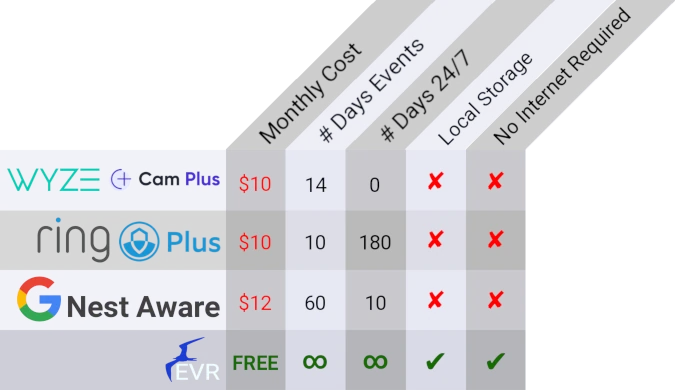

# fEVR - frigate Event Video Recorder

[](https://github.com/BeardedTek-com/fevr/blob/0.1.0/LICENSE)
[](https://t.me/BeardedTekfEVR)
[](https://github.com/BeardedTek-com/fEVR/discussions)
[](https://github.com/BeardedTek-com/fEVR/releases)
[](https://drone.beardedtek.com/BeardedTek-com/fEVR)
[](https://hub.docker.com/r/beardedtek/fevr)
[](https://twitter.com/intent/tweet?url=https%3A%2F%2Ffevr.video&text=AI%20Object%20Detection%20with%20fEVR%20-%20frigate%20Event%20Video%20Recorder)
[](https://twitter.com/intent/user?screen_name=beardedtek)

[](http://pinterest.com/pin/create/button/?url=http%3A%2F%2Ffevr.video&media=&description=AI%20Object%20Detection%20with%20fEVR%20-%20frigate%20Event%20Video%20Recorder)
[](https://reddit.com/submit?url=https://fevr.video&title=AI%20Object%20Detection%20with%20fEVR%20-%20frigate%20Event%20Video%20Recorder)
[](http://www.linkedin.com/shareArticle?mini=true&url=http%3A%2F%2Ffevr.video&title=AI%20Object%20Detection%20with%20fEVR%20-%20frigate%20Event%20Video%20Recorder)
[](https://www.paypal.com/donate/?hosted_button_id=ZAHLQF24WAKES)
[](https://github.com/sponsors/BeardedTek-com)
[](https://tallyco.in/s/waqwip/)

fEVR works along side of [frigate](https://frigate.video) to collect video and snapshots of objects detected using your existing camera systems.
<p align="center">

</p>
<p align="center">
fEVR v0.6 Screenshots
</p>

# Own Your Home's Security

fEVR allows you to own your home's camera system.  Instead of paying multiple cloud providers varying rates to perform object detection and recording, bring them all into fEVR in your very own open source self-hosted solution!  Google, Wyze, Ring, and varying Tuya based cameras all use your data AND want to charge you to store it in the cloud.
<p align="center">

</p>
<p align="center">
Feature comparison to leading cloud event detection providers
</p>

---

# Requirements:
- Frigate fully setup and working
- MQTT Broker (if you have frigate running, you have this) listening to 0.0.0.0
  - This caused me many headaches, hopefully it saves you some hair pulling.
    It allows mqtt clients on different subnets to access the broker.
    If setup within your local lan this does not alone open up external access, only to other subnets which already have access.
  - Example mosquitto.conf listener section if using port 1883
    ```
    listener 1883 0.0.0.0
    ```

## Optional but nice:
- Tailscale Account (for secure remote access)

---

# Support
Please note, I will generally answer questions within 24 hours, and most times even faster unless I'm on vacation or going on adventures with the family.

- [Submit an Issue](https://github.com/BeardedTek-com/fEVR/issues)
  - This is the preferred method if you find an error in the code or something that crashes fEVR.
  
- [Start a discussion](https://github.com/BeardedTek-com/fEVR/discussions)
  - For discussing configuration issues or things that bug you (UI tweaks or process improvements)
  
- [Telegram Support Channel](https://t.me/BeardedTekfEVR)
  - For troubleshooting, a quick question, or you just want to say hi!

- [Matrix Support Space](https://matrix.to/#/#fevrsupport:matrix.org)

---
# Development
## Main Branch
The main branch is the current release branch.  When I do a release on 0.6 it will be merged to here.

## 0.6 Branch
Each major version will have its own branch.  This is the current gold standard for the newest release in 0.6

## 0.6-dev Branch
This is the development branch for v0.6  Any changes will be added here before being merged with the 0.6 Branch

## 0.7-dev Branch
This is the development branch for the next version.  If it introduces breaking changes, it belongs here.

# Releases
## Docker
**docker compose** is the recommended method to deploy fEVR

#### GitHub Container Repository ghcr.io (preferred location)
ghcr.io/beardedtek-com/fevr
#### Docker Hub
beardedtek/fevr

The following tags are available:
- **RECOMMENDED**
  - latest
    - This contains the latest release in the current stable branch

  - 0.6
    - This contains the latest release in the 0.6 branch

- **NOT RECOMMENDED**
  - 0.6-dev 
    - Latest development image in the 0.6 branch.  This could potentially change a couple times a day when under heavy development.
  - 0.7-dev **NOT RECOMMENDED**
    - Bleeding Edge and almost guaranteed to contain **breaking changes**

## PyPi
### **NOT RECOMMENDED**
I'm starting to release some code on pypi as I break a few things apart for the 0.7 branch.  Use at your own risk.  It may or may not work as intended for now and breaking changes are certainly coming before this is an official release channel.
# Documentation
## **[Main API Calls](docs/API.md)**
## **[mqtt_client](docs/MQTT_CLIENT.md)**
---

# Installation

## Docker Compose:
docker-compose is the preferred installation method

### Environment Variables
The following environment variables can be used to configure fEVR:
If not set, configuration can be done via the Web UI.

- FEVR_TRANSPORT
  - http or https
- FEVR_URL
  - defaults to 'fevr'
- FEVR_PORT
  - defaults to 5090
- FEVR_DEVELOPMENT
  - If set to true, it will use the builtin flask server in development/debug mode
  - If set to false or unset, it will use uwsgi server.
- TAILSCALE_ENABLE
  - Enable or disable tailscale functionality
  - [Sign up for tailscale](https://login.tailscale.com/start) prior to use.
- TAILSCALE_TAGS
  - Use tailscale tags
  - To use tags, you must [set them up](https://login.tailscale.com/admin/acls) first.
- TAILSCALE_HOSTNAME
  - Set hostname for tailscale
-TAILSCALE_AUTHKEY
  - You must [generate an auth key](https://login.tailscale.com/admin/settings/keys) first.

### Edit .env file
Copy template.env to .env and adjust as necessary:
NOTE: The IP addresses in the .env file are for internal bridge networking and SHOULD NOT be on the same subnet as your home network.
The default values should serve you well.
```
### fEVR Setup ######################################################

# Set fevr in development mode using built in flask server (true/false)
FEVR_DEVELOPMENT=false

# Changes the port fEVR runs on DEFAULT: 5090
FEVR_PORT=5090

### Tailscale #######################################################

# Set to false to disable tailscale
TAILSCALE_ENABLE=true

TAILSCALE_TAGS=tag:fevr
TAILSCALE_HOSTNAME=fevr

# Obtain Auth Key from https://login.tailscale.com/admin/authkeys
TAILSCALE_AUTHKEY=tskey-XXXXXXXXXXXX-XXXXXXXXXXXXXXXXXXXXXX


### Tailscale #######################################################

# Set to false to disable tailscale
TAILSCALE_ENABLE=true

TAILSCALE_TAGS=tag:fevr
TAILSCALE_HOSTNAME=fevr


# Obtain Auth Key from https://login.tailscale.com/admin/authkeys
TAILSCALE_AUTHKEY=tskey-XXXXXXXXXXXX-XXXXXXXXXXXXXXXXXXXXXX
```

```
version: '2.4'
services:
  fevr:
    image: ghcr.io/beardedtek-com/fevr:0.6
    container_name: fevr
    restart: unless-stopped
    privileged: true
    ports:
      - 5090:${FEVR_PORT:-5090}
    volumes:
      - ./events:/fevr/app/static/events
      - ./data:/fevr/app/data
      - ./varlib:/var/lib
    environment:
      FEVR_DEVELOPMENT: ${FEVR_DEVELOPMENT:-false}
      TAILSCALE_ENABLE: ${TAILSCALE_ENABLE:-false}
      TAILSCALE_AUTHKEY: ${TAILSCALE_AUTHKEY}
      TAILSCALE_HOSTNAME: ${TAILSCALE_HOSTNAME:-fevr}
      TAILSCALE_TAGS: ${TAILSCALE_TAGS}
```

Bring the system up:
```
docker-compose up -d
```

# Setup

- Visit http(s)://<fevr_url>/setup
- Create admin account
- Login to new admin account
- Add all of your cameras.
  - It asks for both HLS and RTSP feeds.  Technically you don't need to enter anything but the camera name, but in a future release live view and frigate config will be enabled and will require these values
  - Click Next
- Configure Frigate
  - make one entry called 'frigate' (without the quotes) with your internally accessible frigate URL
  - make another entry called 'external' (without the quotes) with your externally accessible frigate URL
    - This is 100% Optional.  It does, however, enable live view outside your network.
    - If you don't have an externally accessible frigate URL, you can skip this step.
  - Click Next
- Other is not populated yet, There are future plans for this page, just click Next again and you'll be brought to the main interface.
- Generate API Key for mqtt_client
  - mqtt_client authenticates with fEVR using a 128 character API Key.
  - You can generate an API Key from `/profile` or click on the beard icon to drop down the menu, and click Profile.
  - Here you can view any API keys you have generated in the past and generate a new one.
  - There are 3 fields to fill out:
    - Name: A unique name to identify this key (no duplicates allowed)
    - IPv4 Address: Not used as of now but required to be a valid IP or network (without cidr notation)
      - Enter 0.0.0.0 to future proof.
    - Login Count: this can be used to limit the amount of times this API Key can be used.  While not used at the moment, it will function as the base of a limited login solution (say one time passwords for law enforcement and the like)
      - Enter 0 for unlimited usage
- Configure mqtt_client
  - Once you have your API Key you can generate your config file for the mqtt_client.
    - [See mqtt_client docs here](docs/MQTT_CLIENT.md) for an example
  - This should be automated further in 0.6.1

# Home Assistant Notifications
As of right now it's a bit complicated. For each notification type you want for each camera, a helper entity must be added.
For example, I have notifications setup for my driveway camera for person, animal, and vehicle, so I have the following helpers:
- fevrDrivewayAnimal
- fevrDrivewayCar
- fevrDrivewayPerson

The automation uses this helper entity for 2 purposes.
- As a motion sensor
  - If the helper is on, that means a notification is active
- As a pause for notifications
  - If the helper is on, it does not allow further notifications until it is turned off.
  - In the automation, this time can be adjusted to your liking

Here is the automation I'm currently using:
As displayed when:
- editing the automation via the UI
- click on overflow menu (3 dots)
- click Edit in YAML

NOTES:
- ***CAMERA*** is the camera name
- ***HELPER ENTITY*** is the entity you created for this notification
- ***YOUR FEVR URL*** is the url to your fevr instance

```
alias: fEVR <<CAMERA>> Person Alert
description: fEVR Object Detection Alerts
trigger:
  - platform: mqtt
    topic: frigate/events
condition:
  - condition: template
    value_template: '{{ trigger.payload_json["type"] == "end" }}'
  - condition: template
    value_template: |-
      {{
      trigger.payload_json["after"]["label"] == "person"
      }}
  - condition: template
    value_template: |-
      {{
      trigger.payload_json["after"]["top_score"] > 0.76
      }}
  - condition: template
    value_template: |-
      {{
      trigger.payload_json["after"]["camera"] == "<<CAMERA>>"
      }}
action:
  - choose:
      - conditions:
          - condition: state
            state: 'off'
            entity_id: input_boolean.fevrbackyardperson
        sequence:
          - service: notify.mobile_app_sg20plus
            data:
              message: '{{ trigger.payload_json["after"]["label"] | title }} Detected'
              data:
                notification_icon: mdi:cctv
                ttl: 0
                priority: high
                sticky: true
                actions:
                  - action: URI
                    title: Clip
                    uri: >-
                      <<YOUR FEVR URL>>/event/{{trigger.payload_json['after']['id']}}/snap
                  - action: URI
                    title: Snapshot
                    uri: >-
                      <<YOUR FEVR URL>>/event/{{trigger.payload_json['after']['id']}}/snap
                image: >-
                  <<YOUR FEVR URL>>/static/events/{{trigger.payload_json['after']['id']}}/snapshot.jpg
                tag: '{{trigger.payload_json["after"]["id"]}}'
                alert_once: true
          - service: input_boolean.turn_on
            data: {}
            target:
              entity_id: input_boolean.<<HELPER ENTITY>>
          - delay:
              hours: 0
              minutes: 1
              seconds: 0
              milliseconds: 0
          - service: input_boolean.turn_off
            data: {}
            target:
              entity_id: input_boolean.<<HELPER ENTITY>>
    default: []
mode: single
```
